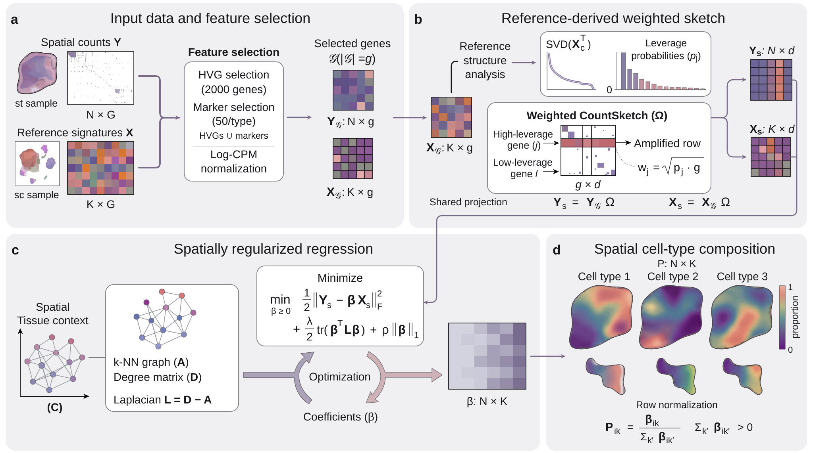

# FlashDeconv

[](https://pypi.org/project/flashdeconv/)
[](https://github.com/cafferychen777/flashdeconv/actions/workflows/test.yml)
[](https://opensource.org/licenses/BSD-3-Clause)
[](https://www.python.org/downloads/)
[](https://doi.org/10.5281/zenodo.18109003)

**Estimate spatial cell-type proportions at atlas scale.**

FlashDeconv estimates cell type proportions from spatial transcriptomics data (Visium, Visium HD, Stereo-seq). It is designed for large-scale analyses where computational efficiency is essential, using reference-derived gene weighting and sparse spatial regularization.

> **Paper:** Yang, C., Zhang, X. & Chen, J. FlashDeconv enables atlas-scale, multi-resolution spatial deconvolution via structure-preserving sketching. *bioRxiv* (2025). [DOI: 10.64898/2025.12.22.696108](https://doi.org/10.64898/2025.12.22.696108)

---

## Installation

```bash
pip install "flashdeconv[io,scanpy]"
```

Requires Python 3.9–3.12. This installs the dependencies used in the Quick Start below. For development or additional I/O support, see [Installation Options](#installation-options).

---

## Quick Start

```python
import scanpy as sc
import flashdeconv as fd

# Load count matrices, spatial coordinates, and reference cell-type labels
adata_st = sc.read_h5ad("spatial.h5ad")
adata_ref = sc.read_h5ad("reference.h5ad")

# Deconvolve
fd.tl.deconvolve(adata_st, adata_ref, cell_type_key="cell_type")

# Rows are spatial locations; columns are reference cell types
proportions = adata_st.obsm["flashdeconv"]
print(proportions.head())
```

The example expects raw counts in `.X`, spatial coordinates in `adata_st.obsm["spatial"]`, and reference labels in `adata_ref.obs["cell_type"]`. If counts are stored in layers, pass `layer_st="counts"` and `layer_ref="counts"`. Match gene identifiers across datasets before running; the AnnData interface intersects and aligns shared genes.

FlashDeconv is also available as a tool in [ChatSpatial](https://github.com/cafferychen777/ChatSpatial), an MCP server for spatial transcriptomics — run deconvolution through natural language from any compatible client.

---

<a id="algorithm"></a>

## How it works

[](paper/figures/figure1.pdf)

1. Select the union of spatial highly variable genes and reference markers; derive leverage scores from the reference signatures.
2. Apply the selected preprocessing (log-CPM by default) and a shared weighted CountSketch to spatial and reference expression. Hashing is uniform, with random signs and leverage-weighted amplitudes; the default sketch dimension is 512.
3. Construct a sparse spatial neighbor graph and fit non-negative regression coefficients with spatial smoothing and an L1 penalty.
4. Normalize each coefficient row to obtain estimated cell-type proportions.

The regression operates on the sketched matrices:

```text
minimize  ½‖Y_s − βX_s‖²_F + ½λ Tr(βᵀLβ) + ρ_eff‖β‖₁,  subject to β ≥ 0
```

Here `Y_s` is N × d, `X_s` is K × d, and `L = D − A` is the spatial graph Laplacian. The solver scales the user parameter as `ρ_eff = rho_sparsity × mean(diag(X_s X_sᵀ))`.

`beta_` contains regression coefficients, not absolute cell counts. `proportions_` contains their row-normalized values, `P[i, k] = β[i, k] / sum(β[i, :])`. An all-zero coefficient row is assigned a uniform distribution as a numerical fallback, not evidence of equal biological composition.

With fixed gene count, sketch dimension, cell-type count, iteration count, and bounded graph degree, the regression stage has linear time and memory scaling in the number of spots. End-to-end runtime also includes preprocessing and neighbor search; it is not an unconditional O(N) guarantee. Radius graphs can become dense when many spots fall within the radius.

---

## Performance

### Scalability

| Spots | Time | Memory |
|:------|:-----|:-------|
| 10,000 | < 1 sec | < 1 GB |
| 100,000 | ~4 sec | ~2 GB |
| 1,000,000 | ~3 min | ~21 GB |

Reported on MacBook Pro M2 Max (32GB unified memory), CPU-only. The million-spot result uses simulated data. These timings describe the benchmark configurations, not a runtime guarantee for arbitrary gene counts, cell-type counts, or graph settings.

### Accuracy

On the 54 Silver Standard datasets (6 tissues × 9 abundance patterns) from the [Spotless benchmark](https://github.com/saeyslab/spotless-benchmark):

| Metric | FlashDeconv | RCTD | Cell2Location |
|:-------|:------------|:-----|:--------------|
| Mean Pearson correlation | 0.944 | 0.934 | 0.918 |

Values follow the current manuscript’s unified benchmark table (Silver Standard rows). These datasets use simulated mixtures; rankings differ on real-data benchmarks. See the [reproducibility repository](https://github.com/cafferychen777/flashdeconv-reproducibility) for benchmark materials. Evaluate performance on data and reference conditions relevant to your application.

---

## API

See the [Quick Start](#quick-start) for the AnnData interface and the [full API reference](docs/api_reference.md) for methods, I/O utilities, and evaluation functions.

### NumPy

Provide spatial counts `Y` (N × G), reference signatures `X` (K × G), and coordinates `coords` (N × 2 or N × 3). The columns of `Y` and `X` must contain the same genes in the same order.

```python
from flashdeconv import FlashDeconv

model = FlashDeconv(
    sketch_dim=512,
    lambda_spatial="auto",
    n_hvg=2000,
    k_neighbors=6,
    random_state=0,
)
proportions = model.fit_transform(Y, X, coords)
```

### Parameters

| Parameter | Default | Description |
|:----------|:--------|:------------|
| `sketch_dim` | 512 | Sketch dimension |
| `lambda_spatial` | "auto" | Spatial regularization, automatically scaled by default |
| `rho_sparsity` | 0.01 | L1 sparsity penalty (dimensionless fraction) |
| `n_hvg` | 2000 | Highly variable genes |
| `n_markers_per_type` | 50 | Marker genes per cell type |
| `spatial_method` | "knn" | Graph method: "knn", "radius", or "grid" |
| `k_neighbors` | 6 | Spatial graph neighbors (for "knn") |
| `radius` | None | Neighbor radius (required for "radius") |
| `preprocess` | "log_cpm" | Normalization: "log_cpm", "pearson", or "raw" |
| `random_state` | 0 | Random seed for reproducibility |

### Output

| Attribute | Description |
|:----------|:------------|
| `proportions_` | Cell type proportions (N × K), sum to 1 |
| `beta_` | Unnormalized regression coefficients (N × K) |
| `info_` | Convergence statistics |

---

## Input Formats

- **Spatial data:** AnnData, NumPy array (N × G), or SciPy sparse matrix
- **Reference:** AnnData (aggregated by cell type) or NumPy array (K × G)
- **Coordinates:** Extracted from `adata.obsm["spatial"]` or NumPy array (N × 2 or N × 3)

---

## Reference quality and limitations

- Use reference annotations supported by marker expression, and check that expected tissue cell types are represented. Missing types can distort the estimated proportions of included types.
- Assess signature stability across cells or donors. Required sample size depends on heterogeneity, sequencing depth, and separation between types; there is no universal cell-count or marker-fold-change cutoff.
- Inspect highly correlated signatures and consider a coarser annotation when subtypes cannot be distinguished reliably.
- Review labels such as `Unknown` or `Unassigned` before aggregation. A heterogeneous pool can produce an ambiguous signature, but the label alone is not a reason to discard a coherent population.
- Spatial smoothing can blur sharp boundaries. Compare smoothing strengths when boundaries or rare populations are central to the analysis.
- Estimated proportions depend on reference quality and preprocessing; they are not direct measurements of cell numbers. Available uncertainty methods are approximations and do not account for every source of reference or model uncertainty.

---

## Installation Options

```bash
# Standard
pip install flashdeconv

# With AnnData support
pip install "flashdeconv[io]"

# Development
git clone https://github.com/cafferychen777/flashdeconv.git
cd flashdeconv && pip install -e ".[dev]"
```

**Requirements:** Python 3.9–3.12, numpy, scipy, numba. Optional: scanpy, anndata.

---

## Citation

If you use FlashDeconv in your research, please cite:

> Yang, C., Zhang, X. & Chen, J. FlashDeconv enables atlas-scale, multi-resolution spatial deconvolution via structure-preserving sketching. *bioRxiv* (2025). [DOI: 10.64898/2025.12.22.696108](https://doi.org/10.64898/2025.12.22.696108)

```bibtex
@article{yang2025flashdeconv,
  title={FlashDeconv enables atlas-scale, multi-resolution spatial deconvolution
         via structure-preserving sketching},
  author={Yang, Chen and Zhang, Xianyang and Chen, Jun},
  journal={bioRxiv},
  year={2025},
  doi={10.64898/2025.12.22.696108}
}
```

---

## Resources

- [Paper reproducibility code](https://github.com/cafferychen777/flashdeconv-reproducibility)
- [Stereo-seq guide](docs/stereo_seq_guide.md) — Platform-specific considerations
- [GitHub Issues](https://github.com/cafferychen777/flashdeconv/issues)
- [BSD-3-Clause License](LICENSE)

---

## Acknowledgments

We thank the developers of [Spotless](https://github.com/saeyslab/spotless-benchmark), [Cell2Location](https://github.com/BayraktarLab/cell2location), [RCTD](https://github.com/dmcable/spacexr), [CARD](https://github.com/YingMa0107/CARD), and other deconvolution methods whose work contributed to this field.
